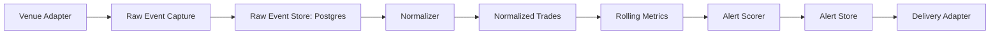
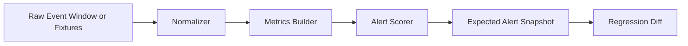
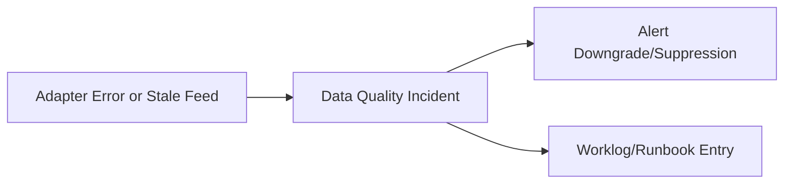

# 04 — Dataflow Diagrams

## Core dataflow

```mermaid
flowchart LR
  A[Venue Adapter] --> B[Raw Event Capture]
  B --> C[Raw Event Store: Postgres]
  C --> D[Normalizer]
  D --> E[Normalized Trades]
  E --> F[Rolling Metrics]
  F --> G[Alert Scorer]
  G --> H[Alert Store]
  H --> I[Delivery Adapter]
```

## Replay dataflow

```mermaid
flowchart LR
  A[Raw Event Window or Fixtures] --> B[Normalizer]
  B --> C[Metrics Builder]
  C --> D[Alert Scorer]
  D --> E[Expected Alert Snapshot]
  E --> F[Regression Diff]
```

## Degraded dataflow

```mermaid
flowchart LR
  A[Adapter Error or Stale Feed] --> B[Data Quality Incident]
  B --> C[Alert Downgrade/Suppression]
  B --> D[Worklog/Runbook Entry]
```
